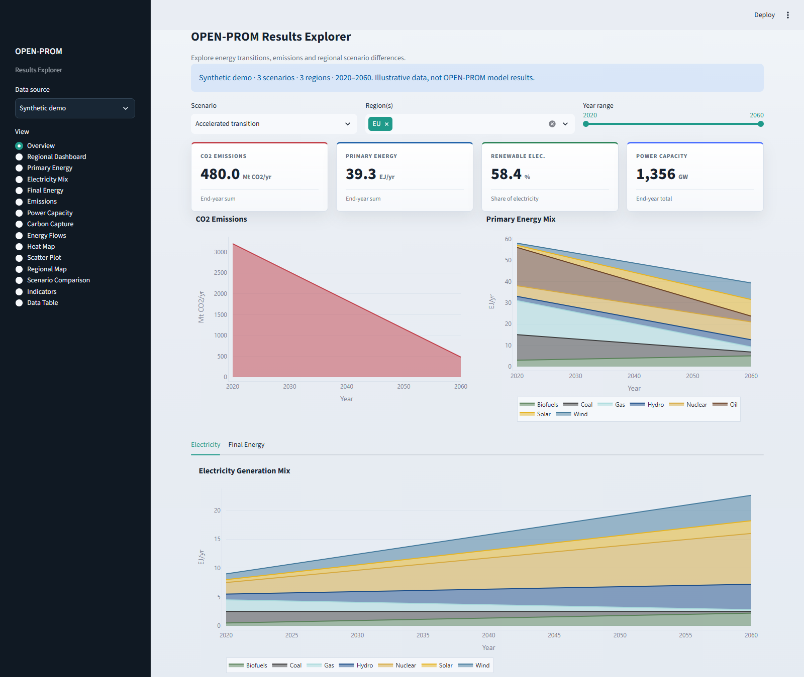
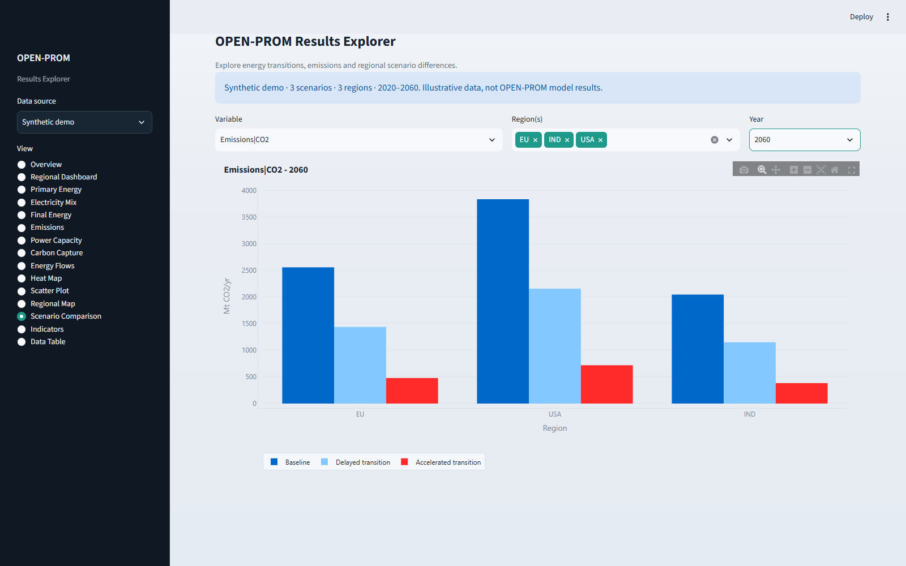

# OPEN-PROM Results Explorer

An interactive dashboard for exploring energy, emissions, capacity, carbon-capture, and socioeconomic results from the OPEN-PROM integrated assessment model. The repository provides two versions of the dashboard:

- A Python application built with Streamlit and Plotly
- An R application built with Shiny, bs4Dash, Plotly, Leaflet, and networkD3

Both applications read the same IAMC-style MIF data and provide filters for comparing scenarios, regions, variables, and years.

## Try the demo

After cloning the repository, open a terminal in its root directory. With Python installed:

```powershell
python -m venv .venv
.\.venv\Scripts\Activate.ps1
python -m pip install -r requirements.txt
python -m streamlit run streamlit_app.py
```

On macOS/Linux, create the environment with `python3 -m venv .venv` and activate it with `source .venv/bin/activate`; the remaining commands are the same.

The dashboard opens with the bundled synthetic dataset when no local `reporting.mif` exists. If you already have local results, select **Synthetic demo** in the sidebar. No model output or account is needed to try it.

The demo includes three scenarios, three regions (EU, USA, IND), and five years from 2020 to 2060. All 15 pages contain example data. These are **illustrative synthetic values, not OPEN-PROM model results**. See [the dataset notes](data/README.md) for assumptions and limitations.

For a quick walkthrough:

1. On **Overview**, select **Accelerated transition** and **EU** to inspect energy, emissions, and renewable-electricity KPIs.
2. Open **Scenario Comparison**, select **Emissions|CO2**, keep all three regions, and choose **2060** to compare the illustrative pathways.
3. Open **Data Table** and use **Download filtered CSV** to inspect the selected observations outside the dashboard.

## Screenshots

Actual Streamlit screenshots using only the bundled synthetic data.





## Dashboard features

The explorer includes:

- Overview and regional KPI dashboards
- Primary-energy and gross inland consumption trends
- Electricity-generation mixes
- Final-energy analysis by sector or carrier
- Installed power capacity and capacity additions
- Greenhouse-gas emissions and carbon-capture trends
- Sankey diagrams of primary-to-final energy flows
- Region-by-year heatmaps and variable scatter plots
- Regional CO2 maps
- Scenario comparisons and socioeconomic indicators
- Filterable data tables and CSV export

## Input data

For your own results, choose **Upload MIF** in the Streamlit sidebar and upload a semicolon-delimited `.mif` or `.csv` file. Alternatively, place an IAMC-format data file named `reporting.mif` in the repository root and choose **Local reporting.mif**. The R application uses this local file automatically when present.

The demo is stored separately and never overwrites your local results:

```text
dashboard/
|-- data/demo.mif
|-- reporting.mif       (optional local results; ignored by Git)
|-- streamlit_app.py
|-- iamc_loader.py
|-- app.R
|-- requirements.txt
`-- README.md
```

The file must be semicolon-delimited and contain these columns:

```text
Model;Scenario;Region;Variable;Unit;2010;2011;...;2100
```

The applications convert the year columns into a long-form dataset when they start. Values that cannot be parsed as numbers are ignored. Variable names are expected to follow the hierarchical IAMC convention, for example:

```text
Emissions|CO2
Primary Energy|Coal
Secondary Energy|Electricity|Wind
Final Energy|Industry
Capacity|Electricity|Solar
```

Use [data/demo.mif](data/demo.mif) as a populated format example. The legacy `test.mif` contains no usable numeric results and cannot run the dashboard by itself. These views assume a single model and compatible units for quantities being combined; the Streamlit KPI cards explicitly reject mixed units. Emissions aggregation prefers reported parent variables over their descendants within each selection.

The CO2 KPI selects exactly `Emissions|CO2`; it never substitutes cumulative emissions, budgets, or sector sums when the annual total is missing. Energy mixes and renewable-share calculations exclude share indicators and overlapping summary categories such as `Renewables` and `Total`. Primary-energy totals are used for the KPI, not stacked with their fuel components. Diagnostic variables remain available in the data table and explicit-variable views. If a Streamlit KPI has incompatible or missing units, only that card shows a warning; the other cards remain visible.

The renewable-electricity KPI is calculated from generation by source: Hydro, Wind, Solar, Biofuels, and Geothermal and other renewable sources, divided by all selected generation components. It can differ from a model's reported `Renewables Share` when that model uses a different definition (for example, excluding biofuels). Reported shares remain accessible through explicit variable selection.

## Run the Python/Streamlit application

### 1. Create a virtual environment

From PowerShell:

```powershell
python -m venv .venv
.\.venv\Scripts\Activate.ps1
```

On macOS or Linux:

```bash
python3 -m venv .venv
source .venv/bin/activate
```

### 2. Install dependencies

```bash
python -m pip install -r requirements.txt
```

### 3. Choose your data

Use the bundled demo immediately, upload your own file from the sidebar, or copy local model output into the repository root as `reporting.mif`.

### 4. Start the dashboard

```bash
streamlit run streamlit_app.py
```

Streamlit will print a local address, normally `http://localhost:8501`, which can be opened in a web browser.

## Run the R/Shiny application

### 1. Install the required R packages

Run the following once in R:

```r
install.packages(c(
  "shiny",
  "bs4Dash",
  "fresh",
  "plotly",
  "ggplot2",
  "dplyr",
  "tidyr",
  "readr",
  "stringr",
  "networkD3",
  "leaflet",
  "DT",
  "scales",
  "shinycssloaders"
))
```

### 2. Choose your data

The R application automatically uses `data/demo.mif` if no `reporting.mif` exists. To load your own results, copy them into the repository root as `reporting.mif`.

### 3. Start the dashboard

Open the repository as the working directory in R or RStudio and run:

```r
shiny::runApp("app.R")
```

Alternatively, open `app.R` in RStudio and select **Run App**.

To force the demo even when local results exist, run:

```r
Sys.setenv(OPEN_PROM_DEMO = "1")
shiny::runApp("app.R")
# After stopping the app, return to normal file selection:
Sys.unsetenv("OPEN_PROM_DEMO")
```

The R application creates `dashboard_cache.rds` for local results or `demo_cache.rds` for demo data. It reuses the cache on later starts while the cache is newer than its input file. An updated input triggers a rebuild on the next start. Streamlit caches by file contents, so selecting or uploading updated data refreshes its dataset.

## Using the dashboard

1. Select an analysis page from the sidebar.
2. Choose one or more scenarios and regions.
3. Set a year or year range, depending on the selected view.
4. Use page-specific filters such as fuel, sector, technology, gas, or indicator.
5. Hover over visualizations to inspect exact values and categories.
6. Open **Data Table** to review the underlying records. In the Streamlit version, use **Download filtered CSV** to export the current selection.

## Troubleshooting

### `reporting.mif` was not found

Confirm that the input file is named exactly `reporting.mif` and is stored in the same directory as `streamlit_app.py` and `app.R`.

In Streamlit you can also choose **Synthetic demo** or **Upload MIF**. R falls back to the bundled demo if the local file is absent.

The Shiny app resolves data paths from the running `app.R`, independently of the active RStudio editor tab. You can launch it from another directory with `shiny::runApp("C:/path/to/dashboard/app.R")`. If demo mode was previously forced, run `Sys.unsetenv("OPEN_PROM_DEMO")` before restarting to use your local results.

### No numeric observations found

The file is empty or contains only missing/non-numeric year values. Use `data/demo.mif` for a working example; the legacy `test.mif` is only a blank template.

### Missing IAMC columns

The input must include `Model`, `Scenario`, `Region`, `Variable`, and `Unit`, followed by one or more four-digit year columns.

### A chart is empty

The selected combination may not exist in the input data, or its variables may not use the expected IAMC hierarchy. Check the **Data Table** view and compare the variable names with the examples above.

### The R dashboard displays old data

Restart the application after updating `reporting.mif`. If necessary, delete `dashboard_cache.rds`; the application will recreate it on the next start.

## Tests

With the Python dependencies installed, run:

```bash
python -m unittest discover -s tests -v
```

The suite checks known KPI totals and units, renewable-electricity shares, scenario/region/year filters, missing and zero values, mixed-unit rejection, IAMC parsing, hierarchy-aware emissions aggregation, regional CO2 values, and sector/carrier separation in energy flows. It also executes all 15 Streamlit pages against the demo dataset and checks for exceptions and chart/table output. No private results are needed.

Run the Shiny path-resolution regressions from the repository root with `Rscript tests/test_shiny_paths.R`. These cover launch directories, nested source files, and (when Shiny is installed) Shiny's actual source loader using a temporary minimal app.

Verified locally with Python 3.10.4, pandas 2.3.3, Streamlit 1.63.0, and Plotly 7.0.0. These are the tested versions, not a lockfile. The automated suite covers the Python implementation; it does not validate the R application's runtime.

## Repository structure

- `streamlit_app.py` - Streamlit interface and Plotly visualizations
- `iamc_loader.py` - IAMC/MIF parser and dataset transformations
- `app.R` - R/Shiny implementation, including data processing and UI
- `requirements.txt` - Python dependencies
- `data/demo.mif` - Populated synthetic demo dataset
- `data/README.md` - Demo assumptions, units, and limitations
- `tests/` - Calculation regression tests and Streamlit page checks
- `docs/images/` - Actual dashboard screenshots used above
- `scripts/capture_screenshots.py` - Reproducible screenshot capture
- `.streamlit/config.toml` - Shared Streamlit color theme
- `test.mif` - Legacy unpopulated IAMC/MIF template
